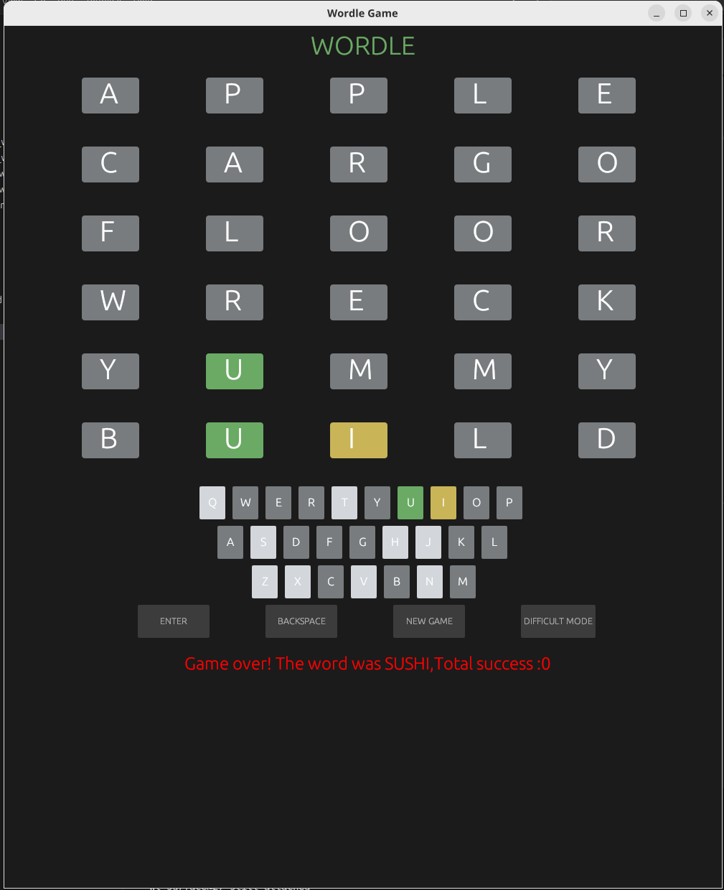

## WORDLE GAME

To begin the game, a rust environment is necessary.

```bash

    Options:
  -w, --word <WORDS>                  user input answer word
  -r, --random                        randomly generate answer word , selected from src/builtin_words.rs
  -D, --difficult                     input must fit previous hints
  -t, --stats                         multiple rounds of games
  -d, --day <DAYS>                    [default: 1] together with shuffle seed , random beginning days
  -s, --seed <SEED>                   shuffle seed
  -f, --final-set <FINAL_REPO>        user-specified answer word bank
  -a, --acceptable-set <ACCEPT_REPO>  user-specified guess word bank
  -S, --state <STATE>                 load state json file
  -c, --config <CONFIG>               load config.json instead of commong line arguments
  -p, --tips                          give guess recommend
  -h, --help                          Print help
  -V, --version                       Print version
```
CIL mood:
```bash
    cd wordle-rust
    cargo run 
```

```bash
    cargo run -- -r -t -d 123 -s 123456 -f input.txt -S input.json -p
```

GUI mood:
GUI mood will automatically load wordle-rust/input.json as state file.
```bash
    cd wordle-rust
    cargo run --bin wordle-gui --features gui
```


